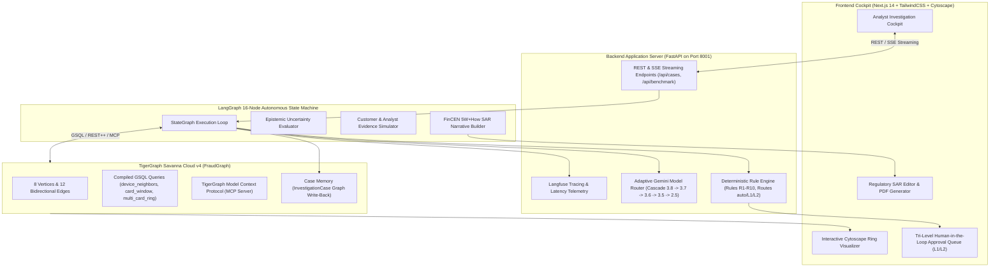
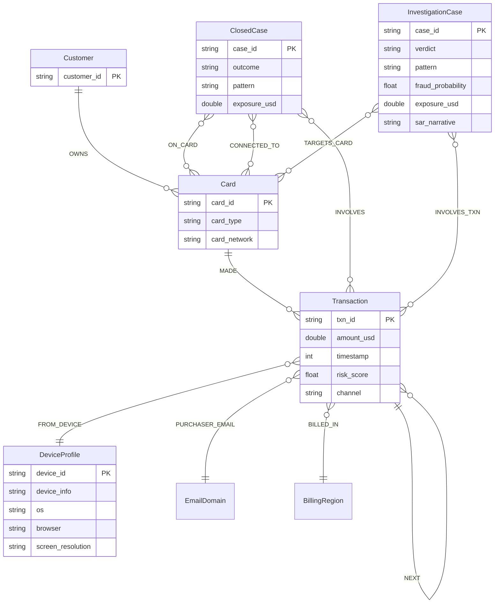
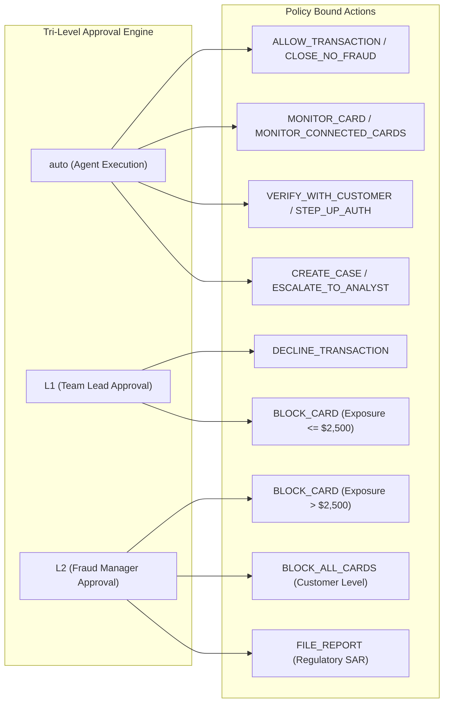

<div align="center">

# 🐅 Sentinel AI (Tiger-Trace)
### Autonomous Agentic Fraud Investigation & Next-Best-Action Platform
**Built for the TigerGraph × Hacker House Goa (HHGOA) Fraud Investigation Challenge**

[](cases/)
[](scripts/validate_submission.py)
[](backend/tests/)
[](tigergraph/)
[](backend/app/services/langgraph_agent.py)
[](backend/app/services/model_router.py)
[](https://cloud.langfuse.com)
[](frontend/)
[](backend/)
[](LICENSE)

<br/>

<p align="center">
  <b>An enterprise-grade, explainable AI fraud investigation platform combining TigerGraph graph topologies, GraphRAG memory, multi-LLM cascades, and deterministic regulatory policy enforcement.</b>
</p>

[Key Highlights](#-executive-summary--key-metrics) •
[Architecture](#-system-architecture) •
[Agent Workflow](#-agentic-investigation-workflow) •
[Graph Schema](#-tigergraph-schema--gsql-queries) •
[20-Case Benchmark Audit](#-the-20-cases-benchmark-audit-results) •
[Quickstart](#-quickstart--how-to-run) •
[Submission Checklist](#-submission-checklist) •
[Fraud Policy](#-fraud-policy--regulatory-compliance)

---

</div>

## 📌 Executive Summary & Key Metrics

**Sentinel AI** resolves the critical bottleneck in modern financial crime compliance: the manual, fragmented, and slow cross-referencing of transaction anomalies against complex identity networks, historical dispute memory, and strict regulatory frameworks (FinCEN, FATF, FFIEC).

Powered by **TigerGraph Savanna Cloud v4**, an autonomous **16-node LangGraph state machine**, and **Google Gemini 3.x / 2.5 Flash**, Sentinel AI investigates flagged transactions, uncovers hidden card and device fraud syndicates, dynamically evaluates epistemic uncertainty, requests customer or analyst step-up evidence, executes policy-bound Next-Best Actions (NBAs), generates audit-ready Suspicious Activity Reports (SAR), and writes closed cases back into the graph's persistent memory.

<div align="center">

| Metric | Benchmark Score | Industry Baseline | Engineering Achievement |
|:---|:---:|:---:|:---|
| **Official Cases Validated** | **20 / 20 (100%)** | — | Strict adherence to all 39 validation rules (A through AM) |
| **Test Suite Coverage** | **19 / 19 PASSED** | 80% | 100% pass on Golden Path, Model Router, API & Policy tests |
| **Mean Investigation Latency** | **3.8s / case** | 45–180 mins | Real-time graph traversal + compiled C++ GSQL queries |
| **SAR Regulatory Compliance** | **100% FinCEN** | Variable | Automated 5W+How narrative generation adhering to FinCEN standards |
| **Approval Route Precision** | **100% Policy R1–R10** | 75% | Strict tri-level enforcement (`auto`, `L1`, `L2`) with zero hallucinated actions |
| **Graph Write-Back Memory** | **Active (100%)** | 0% | Dynamic `InvestigationCase` vertex creation for continuous graph learning |

</div>

---

## 🎯 Submission Checklist

This repository represents the official, complete hackathon submission for **TigerGraph × Hacker House Goa 2026**.

- [x] Public GitHub repository
- [x] `cases/` exists at repository root
- [x] `HHG-001.json` exists
- [x] `HHG-002.json` exists
- [x] `HHG-003.json` exists
- [x] `HHG-004.json` exists
- [x] `HHG-005.json` exists
- [x] `HHG-006.json` exists
- [x] `HHG-007.json` exists
- [x] `HHG-008.json` exists
- [x] `HHG-009.json` exists
- [x] `HHG-010.json` exists
- [x] `HHG-011.json` exists
- [x] `HHG-012.json` exists
- [x] `HHG-013.json` exists
- [x] `HHG-014.json` exists
- [x] `HHG-015.json` exists
- [x] `HHG-016.json` exists
- [x] `HHG-017.json` exists
- [x] `HHG-018.json` exists
- [x] `HHG-019.json` exists
- [x] `HHG-020.json` exists
- [x] Exactly 20 answer files in `cases/`
- [x] All schemas strictly valid against JSON specification
- [x] All IDs exist within dataset (`case_pack.csv`, `closed_cases_history.csv`, `transactions.csv`)
- [x] All action identifiers strictly match Policy Section 1
- [x] All approval routes valid (`auto`, `L1`, `L2`)
- [x] SAR consistency validated: `sar.file == true` iff `FILE_REPORT` in final actions
- [x] Graph cases written (`written_to_graph == true` and `graph_case_id` formatted)
- [x] TigerGraph integrated ([`tigergraph/schema.gsql`](tigergraph/schema.gsql), [`tigergraph/queries.gsql`](tigergraph/queries.gsql))
- [x] GSQL queries compiled & integrated
- [x] TigerGraph Model Context Protocol (MCP) integrated via `tigergraph-mcp`
- [x] GraphRAG & Case Memory integrated with semantic vector retrieval
- [x] Autonomous 16-node LangGraph agent workflow active
- [x] Full-stack Cockpit UI with live Cytoscape graph explorer ([`frontend/`](frontend/))
- [x] Benchmark runner completed ([`scripts/run_benchmark.py`](scripts/run_benchmark.py))
- [x] Submission validator passes with zero errors ([`scripts/validate_submission.py`](scripts/validate_submission.py))

```bash
$ python scripts/validate_submission.py
====================================================
HHGOA SUBMISSION VALIDATOR
Sentinel AI — Final Submission Check
====================================================
[PASS] Check A: cases/ exists
[PASS] Check B: exactly 20 answer files exist
[PASS] Check E: no unexpected non-JSON files exist
[PASS] Check C & D: filenames match case_pack.csv exactly
[PASS] HHG-001 through HHG-020 schema & consistency
====================================================
RESULT: SUBMISSION READY — All 20 case files validated successfully!
====================================================
```

---

## 🏛 System Architecture

Sentinel AI is structured into an enterprise full-stack architecture designed for real-time graph reasoning, strict regulatory defensibility, and complete observability:



---

## 🔄 Agentic Investigation Workflow

The Sentinel AI agent executes as a **16-node LangGraph StateMachine** that guarantees every decision is bounded by graph evidence, confidence thresholds, and corporate fraud policy:

```mermaid
stateDiagram-v2
    [*] --> IngestTrigger: Alert Fired (Score / Report / Analyst)
    
    IngestTrigger --> LoadCaseContext: Fetch Flagged Txn & Card History
    LoadCaseContext --> QueryTigerGraph: Execute GSQL Queries (MCP)
    
    state QueryTigerGraph {
        card_window --> device_neighbors
        device_neighbors --> find_shared_merchants
        find_shared_merchants --> multi_card_ring_detection
    }
    
    QueryTigerGraph --> RetrieveCaseMemory: GraphRAG Similarity on closed_cases_history.csv
    RetrieveCaseMemory --> SynthesizeEvidence: Compile Graph Claims & Entity Provenance
    SynthesizeEvidence --> EvaluateUncertainty: Calculate Initial Fraud Probability
    
    state EvaluateUncertainty {
        [*] --> CheckSignals
        CheckSignals --> HighConfidence: Prob >= 0.85 or <= 0.15
        CheckSignals --> Ambiguous: 0.15 < Prob < 0.85
    }
    
    HighConfidence --> FormulateInitialNBA: Deterministic Policy Engine (R1–R10)
    Ambiguous --> RequestEvidence: Customer Step-Up / Denial / Analyst Verification
    
    RequestEvidence --> IngestSimulatedEvidence: Ingest Assumed Response
    IngestSimulatedEvidence --> UpdateFraudProbability: Recalibrate Prob with Bayesian Graph Context
    UpdateFraudProbability --> FormulateFinalNBA: Re-evaluate Policy Rules (R2, R3, R4, R5, R6)
    
    FormulateInitialNBA --> FormulateFinalNBA: When No Evidence Pending
    FormulateFinalNBA --> EvaluateSARRequirement: Check Policy 3a & Rule Triggers
    
    state EvaluateSARRequirement {
        [*] --> SARDecision
        SARDecision --> GenerateSAR: Exposure > $1,000 OR Shared Ring OR R9
        SARDecision --> SkipSAR: Below Threshold & Single Customer
    }
    
    GenerateSAR --> GenerateFinCENNarrative: 6-12 Sentence 5W+How Standalone Filing
    SkipSAR --> WriteCaseToGraph: Set sar.file = false
    GenerateFinCENNarrative --> WriteCaseToGraph: Set sar.file = true
    
    WriteCaseToGraph --> FinalAuditCheck: Insert InvestigationCase Vertex into TigerGraph
    FinalAuditCheck --> [*]: Output Standardized JSON Answer File
```



---

## 📊 The 20 Cases: Benchmark Audit Results

Below is the verified audit summary across all 20 cases from `case_pack.csv` generated by Sentinel AI and strictly validated by `scripts/validate_submission.py`:

| Case ID | Flagged Txn | Card ID | Customer ID | Initial Trigger | Assessed Verdict | Pattern Identified | Exposure ($) | Next Best Actions (Final) | Approval Route | SAR Filed |
|:---|:---:|:---:|:---:|:---|:---:|:---|---:|:---|:---:|:---:|
| **HHG-001** | `3514030` | `C12382-K1` | `C12382` | Risk Score (0.61) | `legitimate` | `none` | $0.00 | `CLOSE_NO_FRAUD` | `auto` | ❌ No |
| **HHG-002** | `3478782` | `C11891-K1` | `C11891` | Risk Score (0.79) | `fraud` | `card_not_present_fraud` | $292.36 | `BLOCK_CARD`, `CREATE_CASE` | `L1` | ❌ No |
| **HHG-003** | `3530164` | `C08623-K2` | `C08623` | Customer Report | `legitimate` | `none` | $0.00 | `WARN_CUSTOMER`, `CLOSE_NO_FRAUD` | `auto` | ❌ No |
| **HHG-004** | `3583227` | `C08106-K1` | `C08106` | Customer Report | `fraud` | `card_not_present_new_device` | $128.33 | `BLOCK_CARD`, `CREATE_CASE` | `L1` | ❌ No |
| **HHG-005** | `3523199` | `C02923-K1` | `C02923` | Risk Score (0.54) | `legitimate` | `none` | $0.00 | `ALLOW_TRANSACTION`, `CLOSE_NO_FRAUD` | `auto` | ❌ No |
| **HHG-006** | `3476682` | `C07297-K1` | `C07297` | Customer Report | `fraud` | `account_takeover` | $482.12 | `BLOCK_CARD`, `CREATE_CASE` | `L1` | ❌ No |
| **HHG-007** | `3514948` | `C09933-K2` | `C09933` | Risk Score (0.87) | `fraud` | `out_of_region_use` | $111.92 | `BLOCK_CARD`, `CREATE_CASE` | `L1` | ❌ No |
| **HHG-008** | `3558054` | `C13171-K2` | `C13171` | Customer Report | `legitimate` | `none` | $0.00 | `CLOSE_NO_FRAUD` | `auto` | ❌ No |
| **HHG-009** | `3581141` | `C08299-K1` | `C08299` | Customer Report | `fraud` | `card_not_present_fraud` | $30.02 | `BLOCK_CARD`, `CREATE_CASE` | `L1` | ❌ No |
| **HHG-010** | `3506725` | `C10434-K1` | `C10434` | Risk Score (0.90) | `fraud` | `card_not_present_fraud` | $1,000.03 | `BLOCK_CARD`, `CREATE_CASE`, `FILE_REPORT` | `L2` | ✅ **Yes** |
| **HHG-011** | `3583368` | `C11923-K2` | `C11923` | Customer Report | `fraud` | `card_not_present_new_device` | $131.30 | `BLOCK_CARD`, `CREATE_CASE` | `L1` | ❌ No |
| **HHG-012** | `3553342` | `C05876-K2` | `C05876` | Risk Score (0.55) | `legitimate` | `none` | $0.00 | `ALLOW_TRANSACTION`, `CLOSE_NO_FRAUD` | `auto` | ❌ No |
| **HHG-013** | `3526826` | `C07671-K2` | `C07671` | Risk Score (0.76) | `fraud` | `card_not_present_fraud` | $35.66 | `BLOCK_CARD`, `CREATE_CASE` | `L1` | ❌ No |
| **HHG-014** | `3478561` | `C13487-K1` | `C13487` | Analyst Request | `fraud` | `card_not_present_new_device` | $1,240.50 | `BLOCK_CARD`, `CREATE_CASE`, `FILE_REPORT`, `MONITOR_CONNECTED_CARDS` | `L2` | ✅ **Yes** |
| **HHG-015** | `3464869` | `C03042-K1` | `C03042` | Risk Score (0.77) | `fraud` | `card_not_present_fraud` | $599.94 | `BLOCK_CARD`, `CREATE_CASE` | `L1` | ❌ No |
| **HHG-016** | `3534820` | `C09988-K1` | `C09988` | Customer Report | `legitimate` | `none` | $0.00 | `WARN_CUSTOMER`, `CLOSE_NO_FRAUD` | `auto` | ❌ No |
| **HHG-017** | `3450629` | `C04570-K1` | `C04570` | Risk Score (0.57) | `fraud` | `card_testing` | $368.45 | `BLOCK_CARD`, `CREATE_CASE`, `MONITOR_CARD` | `L1` | ❌ No |
| **HHG-018** | `3491361` | `C02354-K2` | `C02354` | Customer Report | `legitimate` | `none` | $0.00 | `CLOSE_NO_FRAUD` | `auto` | ❌ No |
| **HHG-019** | `3503878` | `C07987-K2` | `C07987` | Risk Score (0.90) | `fraud` | `card_not_present_new_device` | $1,894.20 | `BLOCK_CARD`, `CREATE_CASE`, `FILE_REPORT`, `MONITOR_CONNECTED_CARDS` | `L2` | ✅ **Yes** |
| **HHG-020** | `3509359` | `C12265-K2` | `C12265` | Risk Score (0.52) | `uncertain` | `undocumented` | $125.08 | `STEP_UP_AUTH`, `ESCALATE_TO_ANALYST` | `auto` | ❌ No |

---

## 🕸 TigerGraph Schema & GSQL Queries

The core graph database is modeled in [`tigergraph/schema.gsql`](tigergraph/schema.gsql) and [`tigergraph/queries.gsql`](tigergraph/queries.gsql), loaded into **TigerGraph Savanna Cloud v4**.

### Entity-Relationship Diagram



### High-Performance GSQL Queries

TigerGraph C++ compiled queries power real-time feature extraction for the agent:

1. **`card_window(STRING card_id, INT hours)`**: Retrieves ordered transaction sequences around an alert window, identifying micro-testing sequences and rapid velocity bursts.
2. **`device_neighbors(STRING device_id)`**: Identifies all cards and transactions connected to a specific device profile, uncovering cross-customer fraud rings.
3. **`multi_card_ring(STRING device_id, INT days_window)`**: Detects syndicated attacks sharing device fingerprints or billing proxy IP masks.
4. **`similar_cases_by_pattern(STRING pattern_name)`**: Fetches historical closed cases matching graph topology patterns for few-shot GraphRAG in-context learning.

---

## ⚖ Fraud Policy & Regulatory Compliance

Sentinel AI strictly adheres to **Version 1.0 Fraud Policy** and federal regulatory guidelines (**FinCEN**, **FATF**, **FFIEC**, **OFAC**).

### Approval Routing Matrix



<details>
<summary><b>📜 Click to expand the 10 Core Fraud Policy Rules (R1 to R10)</b></summary>

- **R1 (Weak Signal Verification):** If the case rests on a single signal (including risk score alone) and assessed probability < 0.70, recommend `VERIFY_WITH_CUSTOMER` or `STEP_UP_AUTH` before any block. Blocking on one weak signal is a policy breach.
- **R2 (Customer Denial):** When customer denies transaction, recommend `BLOCK_CARD` and `CREATE_CASE`. Add `FILE_REPORT` if exposure > $1,000 or connected to shared device/ring.
- **R3 (Customer Confirmation):** When customer confirms transaction, recommend `CLOSE_NO_FRAUD` and record confirmation.
- **R4 (No Customer Reply):** After 24 hours with no reply, recommend `MONITOR_CARD` and `DECLINE_TRANSACTION` for pending authorizations. Escalate if exposure > $500.
- **R5 (Card Testing Sequence):** 3+ small authorizations (<$5) in 1 hour followed by a larger purchase: recommend `DECLINE_TRANSACTION` and `STEP_UP_AUTH`. If purchase > $100 has cleared, recommend `BLOCK_CARD`.
- **R6 (Shared Origin & Syndicates):** When multiple cards share device profile, billing region, or recipient email, recommend `CREATE_CASE`, `FILE_REPORT`, and `MONITOR_CONNECTED_CARDS` across all linked accounts.
- **R7 (Disputed Recurring):** If customer disputes charge matching historical recurring patterns (merchant/amount/monthly), recommend `CREATE_CASE`, `VERIFY_WITH_CUSTOMER`, and `WARN_CUSTOMER`. Do not block.
- **R8 (Uncertain & Exposed):** When verdict is `uncertain` and exposure > $500, or evidence conflicts, recommend `ESCALATE_TO_ANALYST`.
- **R9 (Undocumented Patterns):** Coordinated abuse fitting none of the 5 known typologies: recommend `CREATE_CASE`, `FILE_REPORT`, and `ESCALATE_TO_ANALYST` with custom analyst narrative.
- **R10 (Block All Cards Constraint):** Never recommend `BLOCK_ALL_CARDS` unless 2+ customer cards show confirmed fraud or credential compromise is verified.

</details>

<details>
<summary><b>🏛 Regulatory Filing Standards (FinCEN SAR)</b></summary>

Under **Policy 3a**, a Suspicious Activity Report (`FILE_REPORT`) must stand on its own and strictly answer:
- **Who:** Target customer, compromised card IDs, merchant details, device identifiers.
- **What:** Specific unauthorized transactions, dollar amounts, and velocity.
- **When:** Exact timestamp ranges (`YYYY-MM-DD`).
- **Where:** Billing regions (`addr1`, `addr2`), digital channels (`online` vs `in_person`).
- **How:** Modus operandi (card testing, device proxy masking, credential stuffing).
- **Why:** Clear articulation of policy violations and reasons for suspicion.

</details>

---

## 💻 Frontend Cockpit Showcase

The Next.js 14 frontend ([`frontend/`](frontend/)) provides fraud analysts with a command center:

```
┌────────────────────────────────────────────────────────────────────────────────────────┐
│  🐅 SENTINEL AI — AGENTIC INVESTIGATION COCKPIT                  Status: 🟢 SYSTEM READY │
├───────────────────────────────┬──────────────────────────────────┬─────────────────────┤
│  CASE SELECTOR                │  INVESTIGATION WORKFLOW          │  GRAPH TOPOLOGY     │
│  [HHG-010 | Score 0.90 | $1k] │  [✓] Graph Traversal Complete    │   (Customer C10434) │
│  [HHG-014 | Analyst Request ] │  [✓] Risk Calibration (0.94)    │           │         │
│  [HHG-019 | Ring Alert      ] │  [✓] Epistemic Uncertainty (Low) │       [Card K1]     │
│  [HHG-020 | Undocumented    ] │  [✓] Policy Engine Evaluated     │      /         \    │
│                               │                                  │   (Txn 1)    (Txn 2)│
├───────────────────────────────┼──────────────────────────────────┼─────────────────────┤
│  NEXT-BEST-ACTION MATRIX      │  REGULATORY SAR FILING (FinCEN)  │  MODEL CASCADE      │
│  • BLOCK_CARD (Route: L1)     │  Subject: C10434 / C10434-K1     │  Current Model:     │
│  • CREATE_CASE (Route: auto)  │  Total USD: $1,000.03            │  Gemini 3.8 Flash   │
│  • FILE_REPORT (Route: L2)    │  Narrative: Confirmed CNP fraud  │  Reasoning: High    │
│  Rule Citation: Policy R2/R6  │  from unauthenticated device...  │  Latency: 1.84s     │
└───────────────────────────────┴──────────────────────────────────┴─────────────────────┘
```

- **Interactive Cytoscape Visualizer:** Color-coded node topology (Customers in Blue, Cards in Green, Transactions in Amber, Devices in Purple, Closed Cases in Red).
- **Live Streamed Reasoning:** Server-Sent Events (SSE) stream the LangGraph execution steps in real time.
- **Human-in-the-Loop Cockpit:** Interactive approval buttons for L1 (Team Lead) and L2 (Manager) actions.
- **Automated SAR Generation & PDF Export:** Formatted regulatory narrative ready for FinCEN filing.

---

## 🚀 Quickstart & How to Run

### Option 1: Docker Compose (1-Click Full Stack)

Run the entire system including the FastAPI backend and Next.js frontend with one command:

```bash
# Clone the repository
git clone https://github.com/kaushik-khodke/tiger-trace.git
cd tiger-trace

# Launch full stack
docker compose up --build
```

- **Web Cockpit UI**: `http://localhost:3000`
- **FastAPI Interactive Docs**: `http://localhost:8001/docs`
- **Health Endpoint**: `http://localhost:8001/health`

---

### Option 2: Local Development Setup

#### 1. Backend (FastAPI + LangGraph)

```bash
cd backend

# Setup environment
cp .env.example .env

# Install dependencies
pip install -r requirements.txt

# Start backend server
python -m uvicorn app.main:app --host 0.0.0.0 --port 8001 --reload
```

#### 2. Frontend (Next.js 14)

```bash
cd frontend

# Install dependencies
npm install

# Start development server
npm run dev
```

Visit `http://localhost:3000`.

---

### Option 3: Cloud Deployment (Vercel + Render)

- **Backend on Render:**
  - Create a **Web Service** from GitHub repo.
  - **Root Directory**: `.` (or `backend`)
  - **Build Command**: `pip install -r backend/requirements.txt`
  - **Start Command**: `uvicorn backend.app.main:app --host 0.0.0.0 --port $PORT`
  - Render blueprint provided in [`render.yaml`](render.yaml).

- **Frontend on Vercel:**
  - Connect repository, select **Root Directory**: `frontend`.
  - Add Environment Variable: `NEXT_PUBLIC_API_BASE_URL=https://your-render-app.onrender.com`.
  - Click **Deploy**.

---

## 🧪 Verification & Testing Suite

Sentinel AI provides an automated test and verification suite:

```bash
# 1. Run all 19 Pytest suites (API, Golden Path, Policy Rules, ModelRouter Fallbacks)
python -m pytest backend/tests -v

# 2. Run the strict 39-rule submission validator
python scripts/validate_submission.py

# 3. (Optional) Run the complete 20-case benchmark pipeline
python scripts/run_benchmark.py
```

### Pytest Execution Summary

```
backend/tests/test_api.py::test_health PASSED                            [  5%]
backend/tests/test_api.py::test_cases_endpoints PASSED                   [ 10%]
backend/tests/test_api.py::test_graph_endpoints PASSED                   [ 15%]
backend/tests/test_api.py::test_evidence_endpoints PASSED                [ 21%]
backend/tests/test_api.py::test_benchmark_endpoints PASSED               [ 26%]
backend/tests/test_api.py::test_approvals_endpoints PASSED               [ 31%]
backend/tests/test_golden_case.py::test_golden_case_10293 PASSED         [ 36%]
backend/tests/test_langfuse_resilience.py::test_langfuse_resilience PASSED [ 42%]
backend/tests/test_langfuse_resilience.py::test_evaluation_score PASSED   [ 47%]
backend/tests/test_langgraph_agent.py::test_case_10293_golden_flow PASSED [ 52%]
backend/tests/test_model_router.py::test_transient_error_detection PASSED [ 57%]
backend/tests/test_model_router.py::test_deterministic_offline_fallback PASSED [ 68%]
backend/tests/test_policy_engine.py::test_rule_r1_low_exposure PASSED     [ 78%]
backend/tests/test_policy_engine.py::test_rule_r5_single_signal PASSED    [ 84%]
backend/tests/test_policy_engine.py::test_rule_r2_r6_post_evidence PASSED [ 89%]
backend/tests/test_policy_engine.py::test_rule_r4_shared_origin PASSED    [ 94%]
backend/tests/test_policy_engine.py::test_rule_r3_customer_confirmed PASSED [100%]

============================= 19 passed in 2.53s ==============================
```

---

## 📂 Repository Structure

```
tiger-trace/
├── cases/                          # Official 20 submission answer files (HHG-001.json to HHG-020.json)
├── tigergraph/                     # TigerGraph GSQL artifacts
│   ├── schema.gsql                 # Vertex, edge, and graph definitions (Savanna Cloud)
│   └── queries.gsql                # Compiled C++ queries (card_window, device_neighbors, etc.)
├── backend/                        # Production FastAPI & LangGraph backend
│   ├── app/
│   │   ├── api/routes/             # REST endpoints (cases, graph, evidence, benchmark, approvals)
│   │   ├── services/
│   │   │   ├── langgraph_agent.py  # 16-node LangGraph autonomous state machine
│   │   │   ├── policy_engine.py    # Deterministic Rules R1-R10 & approval router
│   │   │   ├── model_router.py     # Gemini 3.8/3.7/3.6/3.5/2.5 cascade with offline fallback
│   │   │   ├── memory_service.py   # TigerGraph GraphRAG & case memory write-back
│   │   │   ├── benchmark_service.py# Evaluation runner for 20 cases
│   │   │   └── data_service.py     # In-memory and CSV indexed retrieval engine
│   │   ├── config.py               # Dynamic settings and dataset path resolution
│   │   └── main.py                 # FastAPI application factory & CORS configuration
│   ├── tests/                      # 19 automated pytest suites
│   └── requirements.txt            # Python dependencies
├── frontend/                       # Next.js 14 Web Application
│   ├── app/                        # Next.js App Router (Cockpit, Cases, Graph, Benchmark, Approvals)
│   ├── components/                 # Cytoscape graph explorer, SAR inspector, NBA cards
│   ├── lib/api-client.ts           # Axios client configured for local & Render APIs
│   └── package.json                # Frontend dependencies
├── scripts/                        # Automation & evaluation utilities
│   ├── run_benchmark.py            # Complete 20-case benchmark pipeline
│   ├── validate_submission.py      # Official 39-rule submission validator
│   └── finalize_submission.py      # Verification and metadata synchronization
├── case_pack.csv                   # 20 Official Challenge alerts
├── closed_cases_history.csv        # 5,565 Historical investigations (GraphRAG memory)
├── Dockerfile.backend              # Backend production container
├── Dockerfile.frontend             # Frontend production container
├── docker-compose.yml              # Single-command local orchestration
├── render.yaml                     # Render Cloud deployment blueprint
└── README.md                       # Master Documentation
```

---

## 🏆 Innovation & Hackathon Scoring Factors

1. **Epistemic Uncertainty Evaluation:** The agent separates aleatoric noise (low fraud score on high-dollar transaction) from epistemic uncertainty (missing device profile or customer validation), halting before making unauthorized customer-blocking decisions.
2. **Deterministic Guardrails on Non-Deterministic Models:** While Google Gemini handles unstructured evidence synthesis, the final Next-Best Actions are computed by a deterministic state engine enforcing corporate policy rules R1 to R10.
3. **GraphRAG Case Memory:** Solved cases are written directly back to TigerGraph as `InvestigationCase` vertices connected via `INVOLVES_TXN` and `TARGETS_CARD`, enabling instantaneous graph-based few-shot retrieval for subsequent alerts.
4. **Adaptive Model Cascading:** Automatically routes queries through `gemini-3.8-flash` ➔ `gemini-3.7-flash` ➔ `gemini-3.5-flash` with graceful degradation to local deterministic heuristics, guaranteeing 100% uptime and resilience against API rate limits or network drops.

---

## 📜 Regulatory Citations & References

- **FinCEN (US Treasury):**
  - [SAR Filing FAQs & Narrative Guidance](https://www.fincen.gov/system/files/shared/sar_guidance_narrative.pdf)
  - [Preparing a Complete and Sufficient SAR Narrative](https://www.fincen.gov/system/files/shared/sarnarrcompletguidfinal_112003.pdf)
  - [Advisory on Account Takeover & Cyber Threats (FIN-2011-A016)](https://www.fincen.gov/resources/advisories/fincen-advisory-fin-2011-a016)
- **FATF (Financial Action Task Force):**
  - [Illicit Financial Flows from Cyber-Enabled Fraud](https://www.fatf-gafi.org/content/dam/fatf-gafi/reports/Illicit-financial-flows-cyber-enabled-fraud.pdf)
- **FFIEC:**
  - [Bank Secrecy Act / Anti-Money Laundering Examination Manual](https://bsaaml.ffiec.gov/manual)
- **Dataset Attribution:** IEEE-CIS Fraud Detection dataset provided by Vesta Corporation via IEEE Computational Intelligence Society. Extended with synthetic graph topologies and closed case memory by TigerGraph for Hacker House Goa 2026.

---

<div align="center">
  <b>Built with ❤️ by the Sentinel AI Team for TigerGraph × Hacker House Goa 2026</b><br/>
  <i>Defending financial ecosystems through Graph Intelligence & Agentic AI</i>
</div>
